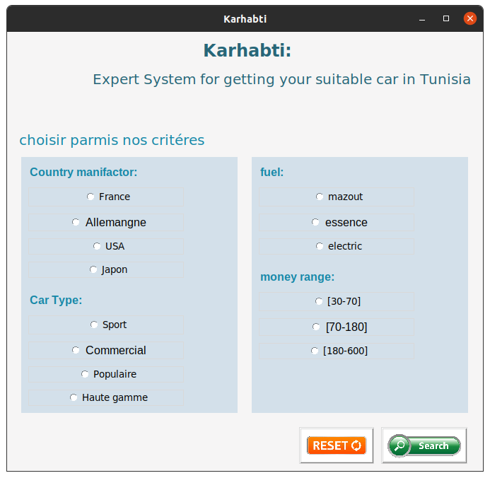
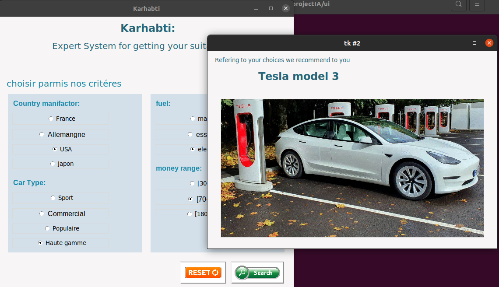
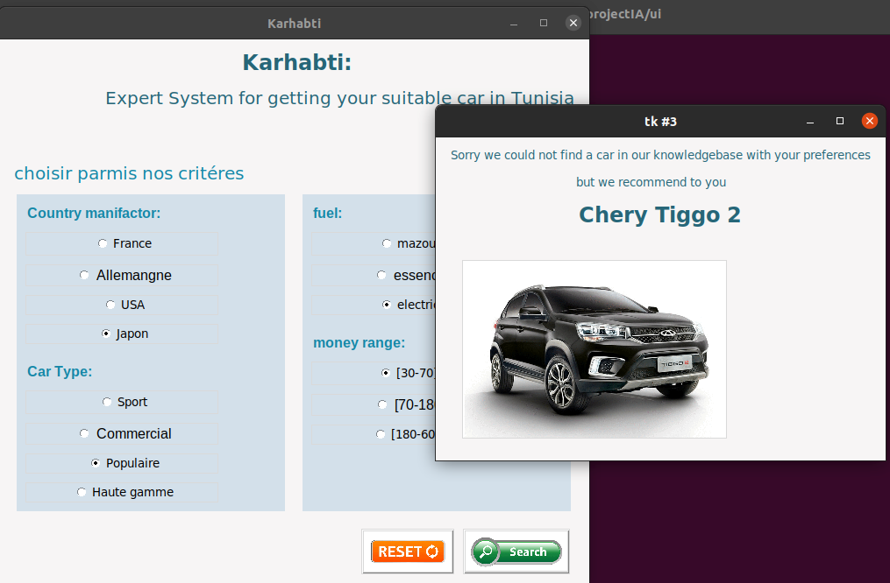
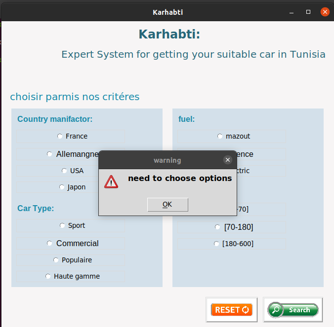

 
# Karhabti 
This application is a simple expert system that helps users choose a car based on their preferences and needs. It uses the Experta library for the expert system logic and Tkinter for the user interface.

## Requirements
- Python 3.x
- Experta library
- Tkinter library (usually comes with Python)

## Screenshots  
|  |  |
|--------------|--------------|
|  |  |
|  |  |

## Run Locally  

Clone the project  

~~~bash  
  git clone https://github.com/Ala-Mabrouk/Karhabti.git
~~~

Go to the project directory  

~~~bash  
  cd Karhabti
~~~

Install Packages  

~~~bash  
  pip install experta
  pip install tk
~~~

## How to Use
1) Run the script
~~~bash  
  karhabti.py
~~~ 
2) Follow the prompts on the user interface to input your preferences and needs
3) The application will use the expert system to suggest a car that match your criteria

## Contact

If you have any questions or would like to get in touch with the maintainers, please email me at [alamabrouk007@gmail.com](mailto:alamabrouk007@gmail.com) 

